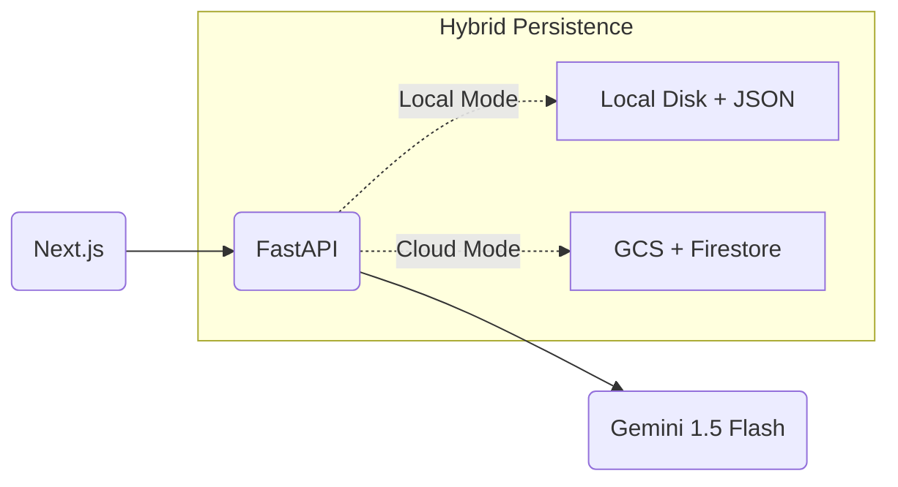

# Kabi Receipts

AI-powered receipt management system built with **Next.js + Tailwind CSS** frontend and **FastAPI** backend. Supports **Gemini Multimodal** extraction (no separate OCR) and full **Offline/Local Mode**.

## ✨ Features

- **Multimodal AI**: Uses Gemini 1.5 Flash to "see" receipts directly (simpler & faster than OCR)
- **Hybrid Storage**: 
  - **Local Mode**: Saves files to disk and data to JSON (for dev/testing)
  - **Cloud Mode**: Saves to Google Cloud Storage and Firestore (for production)
- **Modern UI**: Next.js 16, Tailwind CSS, Dark Mode, Drag-and-drop
- **Free Tier Friendly**: Designed to run within GCP free tier limits

## 🏗️ Architecture



## 🚀 Quick Start (Local Mode)

The easiest way to run the app. Requires only a Gemini API Key.

### 1. Prerequisites
- Python 3.11+
- Node.js 20+
- [Gemini API Key](https://aistudio.google.com/app/apikey)

### 2. Backend Setup
```bash
# Setup Python environment
python -m venv venv
source venv/bin/activate  # Windows: venv\Scripts\activate
pip install -r requirements.txt

# Configure Environment
cp .env.example .env
# Edit .env:
# GOOGLE_API_KEY=your_key_here
# GOOGLE_CLIENT_ID=your_oauth_client_id
# ALLOWED_USERS=email1@gmail.com,email2@gmail.com
# STORAGE_MODE=local
```

**Run Backend:**
```bash
uvicorn app.main:app --reload --port 8080
```

### 3. Frontend Setup
```bash
cd frontend
npm install

# Configure Environment
cp .env.example .env.local
# Edit .env.local (DO NOT use quotes around values):
# GOOGLE_CLIENT_ID=your-client-id
# GOOGLE_CLIENT_SECRET=your-client-secret
# NEXTAUTH_URL=http://localhost:3000
# NEXTAUTH_SECRET=random-32-char-string

# Run Frontend
npm run dev
```
Visit `http://localhost:3000`


## ☁️ Cloud Deployment (GCP)

For production deployment on Google Cloud Run.

1. **Configure `.env` for Cloud:**
   ```bash
   STORAGE_MODE=gcs
   GCP_PROJECT_ID=your-project
   GCS_BUCKET_NAME=your-bucket
   
   # Auth
   GOOGLE_CLIENT_ID=...
   ALLOWED_USERS=user@example.com
   ```

2. **Deploy:**
   ```bash
   ./deploy.sh YOUR_PROJECT_ID
   ```

## 💰 Cost Analysis (Cloud Mode)

With ~5 uploads/week, you stay within the **Free Tier**:

| Service | Usage | Cost |
|---------|-------|------|
| Cloud Run | ~80 req/mo | $0 |
| Gemini 1.5 Flash | ~20 req/mo | $0 |
| Cloud Storage | ~50 MB | $0 |
| Firestore | Minimal | $0 |

**Total: $0/month**

## 🛠️ Tech Stack

- **Frontend**: Next.js 16, Tailwind CSS, TypeScript, Headless UI
- **Backend**: FastAPI, Uvicorn, Python 3.11
- **AI**: Google Gemini 1.5 Flash
- **Cloud**: Cloud Run, Firestore, Google Cloud Storage

## 📝 License

GNU General Public License v3.0
